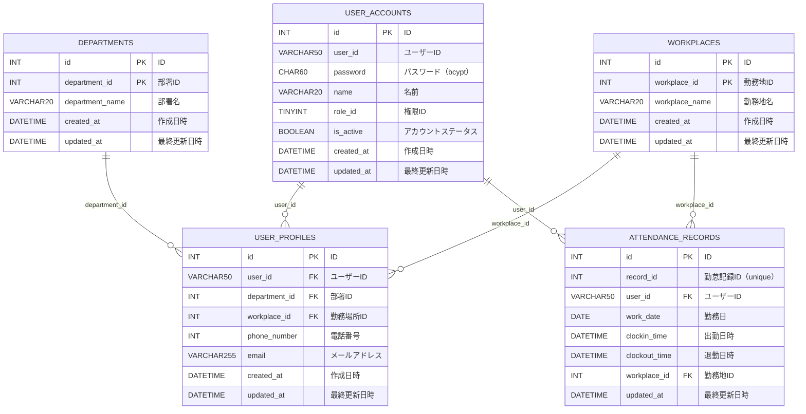

```mermaid
erDiagram
    USER_ACCOUNTS {
        INT id PK "ID"
        VARCHAR50 user_id "ユーザーID"
        CHAR60 password "パスワード（bcypt）"
        VARCHAR20 name "名前"
        TINYINT role_id "権限ID"
        BOOLEAN is_active "アカウントステータス"
        DATETIME created_at "作成日時"
        DATETIME updated_at "最終更新日時"
    }

    USER_PROFILES {
        INT id PK "ID"
        VARCHAR50 user_id FK "ユーザーID"
        INT department_id FK "部署ID"
        INT workplace_id FK "勤務場所ID"
        INT phone_number "電話番号"
        VARCHAR255 email "メールアドレス"
        DATETIME created_at "作成日時"
        DATETIME updated_at "最終更新日時"
    }

    DEPARTMENTS {
        INT id PK "ID"
        INT department_id PK "部署ID"
        VARCHAR20 department_name "部署名"
        DATETIME created_at "作成日時"
        DATETIME updated_at "最終更新日時"
    }

    ATTENDANCE_RECORDS {
        INT id PK "ID"
        INT record_id "勤怠記録ID（unique）"
        VARCHAR50 user_id FK "ユーザーID"
        DATE work_date "勤務日"
        DATETIME clockin_time "出勤日時"
        DATETIME clockout_time "退勤日時"
        INT workplace_id FK "勤務地ID"
        DATETIME updated_at "最終更新日時"
    }

    WORKPLACES {
        INT id  PK "ID"
        INT workplace_id PK "勤務地ID"
        VARCHAR20 workplace_name "勤務地名"
        DATETIME created_at "作成日時"
        DATETIME updated_at "最終更新日時"
    }

    %% リレーション
    USER_ACCOUNTS ||--o{ USER_PROFILES : "user_id"
    USER_ACCOUNTS ||--o{ ATTENDANCE_RECORDS : "user_id"
    DEPARTMENTS ||--o{ USER_PROFILES : "department_id"
    WORKPLACES ||--o{ USER_PROFILES : "workplace_id"
    WORKPLACES ||--o{ ATTENDANCE_RECORDS : "workplace_id"

```